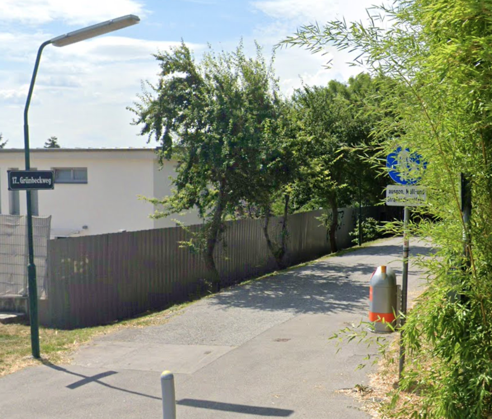

# Griachal vom Friedhof

| Art           | Rote und gelbe Prunus cerasifera (Krischpflaumen)                                                                                                                                                                                                                                                  |
| ------------- | -------------------------------------------------------------------------------------------------------------------------------------------------------------------------------------------------------------------------------------------------------------------------------------------------- |
| Woher         | Grünbeckweg, 1170 Wien Baumnummer: 145, 146 und 147 (siehe [Baumkataster](https://www.wien.gv.at/umweltgut/public/grafik.aspx?ThemePage=11&bookmark=PAstRjL-cUkaHnvtCAAeEQjnC-cs6-crOsX3Z-cJ1b3VCe8VZZP2o-cKSUyDCj9L6uS8mPcxuMUiqGZg04MZ0ONb6ZEYDnvTqmT1OYYb7EuTK7THaPzYbMoCOC-ch-cLmIC1A8-b)) |
| Gepflück      | 2021-09-11 10h                                                                                                                                                                                                                                                                                     |
| **Marmelade** |                                                                                                                                                                                                                                                                                                    |
| Verkocht      | 2021-09-11 13h                                                                                                                                                                                                                                                                                     |
| Menge         | 2kg -> ~1,4l                                                                                                                                                                                                                                                                                       |
| Rezept        | 2kg Griachal 1x Zitronenschale und -Saft 0,5 kg Gelierzucker 3:1 Schuss Grappa                                                                                                                                                                                                         |
| **Likör**     |                                                                                                                                                                                                                                                                                                    |
| Verkocht      | 2021-09-13 14h                                                                                                                                                                                                                                                                                     |
| Menge         | ca. 100g                                                                                                                                                                                                                                                                                           |
| Rezept        | 100g Kerne 50g Zucker 175ml Vodka [likör aus kriecherlkernen](https://www.ichkoche.at/likoer-aus-kriecherlkernen-rezept-239231)                                                                                                                                                        |

