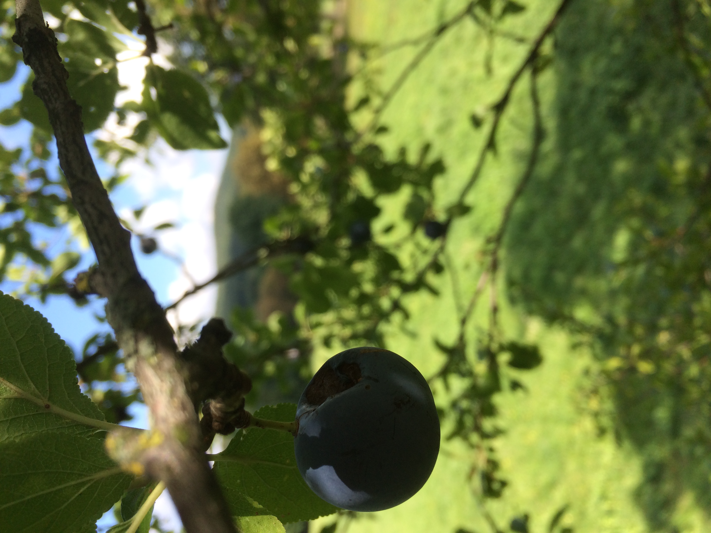

# Lainzer Zwetschke

| Art           | noch zu bestimmende Zwetschke/Pflaume, sehr ründlich, ca. 1,5-2cm Durchmesser                                                                                                |
| ------------- | ---------------------------------------------------------------------------------------------------------------------------------------------------------------------------- |
| Woher         | Dianawiese, Lainzer Tiergarten, 1230 Wien  [48.16656, 16.19447](https://goo.gl/maps/evqjxrCt1w3ob8rf7)                                                                   |
| Gepflück      | 2021-09-12 14h                                                                                                                                                               |
| **Marmelade** |                                                                                                                                                                              |
| Verkocht      | 2021-09-13 12h                                                                                                                                                               |
| Menge         | 1,4kg -> 1400ml Marmelade                                                                                                                                                    |
| Rezept        | 1,4kg Zwetschke 1kg Gelierzucker 1:1 1 Zitrone (Saft) 1 Pkg. Vanillezucker [Marmelade](https://www.gutekueche.at/zwetschkenmarmelade-rezept-42578)           |
| **Röster**    |                                                                                                                                                                              |
| Verkocht      | 2021-09-13 12h                                                                                                                                                               |
| Menge         | 1kg -> 500ml Röster                                                                                                                                                          |
| Rezept        | 1kg Zwetschken 150g Zucker 0,125l Wasser 1 Zitrone (Saft) kleine Zimtstange Nelken [Röster](https://www.gutekueche.at/zwetschkenroester-rezept-1355) |

